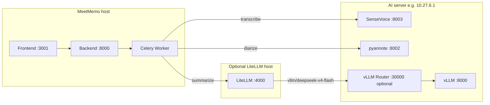

# MeetMemo — AI Meeting Notes

AI-powered meeting transcription, speaker diarization, structured summarization, and action item tracking. Self-hosted with enterprise authentication support.

## Features

- **Audio/Video Upload** — Upload meeting recordings or record from the browser
- **AI Transcription** — SenseVoice (remote GPU, recommended) or faster-whisper (local)
- **Speaker Diarization** — Remote pyannote on GPU server, or local pyannote
- **Structured Summaries** — Ollama, OpenAI, or **LiteLLM** (e.g. DeepSeek-V4-Flash via vLLM)
- **Chinese Punctuation** — Optional FunASR `ct-punc` restoration after ASR
- **Speaker merge** — Overlap-based alignment of diarization labels onto transcript segments
- **Full-Text Search** — PostgreSQL `tsvector`
- **Team Management** — Teams with role-based access
- **Enterprise Auth** — LDAP (Active Directory) and OIDC (Azure AD / Entra ID)
- **PWA** — Installable web app
- **Real-time Updates** — SSE for pipeline progress

## Tech Stack

| Layer | Technology |
|-------|------------|
| Backend API | Python FastAPI |
| Database | PostgreSQL 16 + tsvector |
| Task Queue | Celery + Redis |
| ASR | SenseVoice (FunASR) remote or faster-whisper local |
| Diarization | pyannote remote API or local |
| LLM | Ollama / OpenAI / **LiteLLM proxy** |
| Frontend | Next.js 14 + TypeScript |
| UI | Tailwind CSS + shadcn/ui |
| Auth | LDAP (`ldap3`) + OIDC (`authlib`) |
| Deployment | Docker Compose |

## Architecture (recommended production)

MeetMemo (Docker) runs the API, worker, and UI. Heavy ML runs on a **separate GPU server**.



**Example 8× NVIDIA H20 layout**

| GPU | Service |
|-----|---------|
| 0–3 | vLLM `DeepSeek-V4-Flash`, `--data-parallel-size 4`, port **8000** |
| 4 | SenseVoice (**8003**) + diarizer (**8002**) — shared when VRAM allows |
| 5–7 | spare |

vLLM served model name should match LiteLLM upstream: `deepseek-ai/DeepSeek-V4-Flash` (see LiteLLM config). Optional [vllm-router](https://github.com/vllm-project/vllm) on **30000** in non–PD-disaggregation mode: `--worker-urls http://127.0.0.1:8000`.

## Quick Start

### Prerequisites

- Docker and Docker Compose
- (Recommended) Remote GPU server with SenseVoice + diarizer APIs — see [sensevoice-server/README.md](sensevoice-server/README.md) and [diarizer-server/README.md](diarizer-server/README.md)
- (Optional) LiteLLM + vLLM for summarization
- (Optional) Local GPU only if using faster-whisper / local pyannote instead of remote APIs

### Setup

1. Clone and configure:

   ```bash
   git clone https://github.com/yourusername/meetmemo.git
   cd meetmemo
   cp .env.example .env
   # Edit .env: remote ASR/diarize URLs, LLM_PROVIDER, LDAP, etc.
   ```

2. Start MeetMemo:

   ```bash
   make dev
   ```

3. Open:

   | Service | URL |
   |---------|-----|
   | Frontend | http://localhost:3001 |
   | Backend API | http://localhost:8000 |
   | Flower | http://localhost:5555 |

### Local GPU (faster-whisper only)

```bash
# .env
ASR_PROVIDER=faster-whisper
WHISPER_DEVICE=cuda
DIARIZE_PROVIDER=local   # requires HF_TOKEN for pyannote

make dev-cuda
```

## Environment variables (summary)

Copy from [.env.example](.env.example). Important groups:

### Remote ASR (SenseVoice)

```env
ASR_PROVIDER=sensevoice
SENSEVOICE_MODE=remote
SENSEVOICE_API_URL=http://10.27.6.1:8003
# MeetMemo slices audio before upload when duration > threshold (see below)
SENSEVOICE_CHUNK_SECONDS=3600
SENSEVOICE_REQUEST_TIMEOUT_MAX=7200
```

**ASR:** Remote `sensevoice-server/main.py` uses official **VAD + `merge_vad`** ([demo](https://github.com/FunAudioLLM/SenseVoice/blob/main/demo1.py)). MeetMemo sends the full WAV in one request when `/health` reports `vad_enabled: true`. `SENSEVOICE_CHUNK_SECONDS` is only a fallback for legacy servers without VAD.

**Transcript timeline:** Fine-grained CTC segments from SenseVoice are merged to **sentence-level** blocks in `sensevoice-server/segment_merge.py` and `backend/app/utils/transcript_segments.py` (avoids tens of thousands of one-character rows in the UI).

### Remote diarization

```env
DIARIZE_PROVIDER=remote
DIARIZE_API_URL=http://10.27.6.1:8002
```

Start diarizer with `PORT=8002` (code default is 8001).

### LLM / LiteLLM

```env
LLM_PROVIDER=litellm
LLM_PROXY_URL=http://<litellm-host>:4000
LLM_MODEL=vllm/deepseek-v4-flash
LLM_API_KEY=sk-1234
```

LiteLLM `litellm_params.model` for vLLM routes should use upstream id `deepseek-ai/DeepSeek-V4-Flash` when vLLM is started with `--served-model-name deepseek-ai/DeepSeek-V4-Flash`.

### Long meeting summaries

```env
SUMMARY_MAP_REDUCE_THRESHOLD=12000
SUMMARY_MAX_CHUNK_CHARS=10000
```

Transcripts longer than the threshold use **map-reduce** (chunk → partial summaries → merge) instead of truncating the first 12k characters.

### LDAP / Active Directory

```env
LDAP_ENABLED=true
LDAP_SERVER=ldap://dc-t.dltornado2.com:389
LDAP_BASE_DN=OU=人工智能技术中心,OU=中央研究院,OU=IT,OU=myse,DC=dltornado2,DC=com
LDAP_DOMAIN=dltornado2.com
LDAP_USER_SEARCH_FILTER=(sAMAccountName={})
```

Users can log in with **short account name** (e.g. `116823`). Test-domain user sync from production: [scripts/ad/README.md](scripts/ad/README.md).

### Punctuation (optional)

```env
PUNCTUATION_ENABLED=true
PUNCTUATION_MODEL=ct-punc-c
```

## Usage

1. **Login** — Local admin or LDAP/OIDC
2. **Upload** — Audio/video for a meeting
3. **Process** — Runs preprocess → transcribe → diarize → summarize → store (Celery chain)
4. **Review** — Transcript with speakers and structured summary
5. **Search** — Full-text across meetings

Re-run **Process** after fixing ASR/diarizer; failed meetings stay in `failed` with `error_message` until reprocessed.

To **regenerate only the summary** (keep existing transcript), use the meeting detail UI **Regenerate** button or `POST /api/v1/meetings/:id/summary/regenerate` (requires login; runs map-reduce when transcript exceeds `SUMMARY_MAP_REDUCE_THRESHOLD`).

## Model download (local mode)

When not using remote APIs, models download from **ModelScope** by default:

| Model | ModelScope ID | Use |
|-------|---------------|-----|
| faster-whisper-base | `Systran/faster-whisper-base` | Local ASR |
| speaker-diarization-3.1 | `pyannote/speaker-diarization-3.1` | Local diarization |

```env
MODEL_DOWNLOAD_SOURCE=modelscope
# or huggingface + HF_TOKEN
```

Cache volume: `ml_cache` in Docker Compose.

## API overview

| Endpoint | Description |
|----------|-------------|
| `POST /api/v1/auth/login` | Login |
| `POST /api/v1/meetings` | Upload meeting |
| `GET /api/v1/meetings/:id` | Detail + status |
| `POST /api/v1/meetings/:id/process` | Start pipeline |
| `GET /api/v1/meetings/:id/transcript` | Transcript |
| `GET /api/v1/meetings/:id/transcript/export` | Download transcript as Word (.docx) with speaker and timestamps |
| `GET /api/v1/meetings/:id/summary` | Summary |
| `POST /api/v1/meetings/:id/summary/regenerate` | Re-run summarization only (no re-transcribe) |
| `GET /api/v1/search?q=...` | Search |
| `GET /api/v1/events` | SSE updates |

## Development

```bash
make backend-dev    # API
make worker-dev     # Celery + ML
make frontend-dev   # Next.js
```

After changing `backend/app/tasks/*.py`, recreate or `docker cp` into `docker-worker-1` and restart the worker so Celery picks up remote ASR/diarize logic.

### Project structure

```
meetmemo/
├── backend/              # FastAPI + Celery task definitions
├── worker/               # Celery worker image (ML stack)
├── frontend/             # Next.js UI
├── docker/               # docker-compose.yml
├── sensevoice-server/    # Remote ASR service template + README
├── diarizer-server/      # Remote diarization service template + README
└── scripts/ad/           # LDAP OU/user sync (mywind → dltornado2)
```

## Troubleshooting

| Symptom | Likely cause / fix |
|---------|-------------------|
| **Browser mic “access denied”** on `http://<host>:3001` | Not a hardware issue: browsers block `getUserMedia` outside a [secure context](https://developer.mozilla.org/en-US/docs/Web/Security/Secure_Contexts). Use **file upload**, **SSH tunnel** to `http://localhost:3001`, **HTTPS** reverse proxy, or Chrome `--unsafely-treat-insecure-origin-as-secure=http://<host>:3001` (dev only) |
| **Processing** stays long (e.g. 30+ min) | Worker often runs with **concurrency=1** — one Celery job at a time; a prior long **map-reduce summary** can queue the next meeting. For ~35 min audio, **~15–25 min** end-to-end is normal (ASR ~6 min, diarize ~7 min, summary ~15–20 min). Check `docker logs -f docker-worker-1` |
| Transcript only ~100 “words” for long meeting | Old server without VAD, or UI word count on Chinese (fixed: char count); redeploy `sensevoice-server` v2, confirm `/health` → `vad_enabled: true`, redeploy worker, reprocess |
| Thousands of 1-char transcript segments | Old worker without sentence merge; deploy `transcript_segments.py` + `sensevoice-server/segment_merge.py`, reprocess |
| `<\|zh\|>` tags in UI | Old worker image or server tag regex; redeploy worker + restart SenseVoice |
| **LDAP login fails** with correct password | AD **773** (must change password at next logon): `pwdLastSet=0` or `ChangePasswordAtLogon`. MeetMemo cannot complete AD password change — fix in AD or run [scripts/ad/batch_fix_central_research_users.py](scripts/ad/batch_fix_central_research_users.py). Details: [scripts/ad/README.md](scripts/ad/README.md) |
| ASR 500 / CUDA OOM | SenseVoice on same GPU as vLLM; move ASR to dedicated GPU (`CUDA_VISIBLE_DEVICES`) |
| LiteLLM 404 model | Mismatch: vLLM `--served-model-name` vs LiteLLM upstream id |
| LiteLLM “no healthy deployments” | Backend health check failed; fix vLLM/router, restart LiteLLM |
| Diarize connection refused | Diarizer listening on 8001; start with `PORT=8002` (see [diarizer-server/README.md](diarizer-server/README.md)) |
| Summary truncated / incomplete | Ensure `SUMMARY_MAP_REDUCE_THRESHOLD` is set and worker has map-reduce code; use **regenerate summary** instead of full reprocess |

### Health checks

```bash
curl -s http://<asr-host>:8003/health    # expect "vad_enabled": true
curl -s http://<diarize-host>:8002/health
curl -s http://<meetmemo-host>:8000/api/v1/health
```

### Worker / logs

```bash
docker logs docker-worker-1 --tail 200
docker compose -f docker/docker-compose.yml up -d worker --force-recreate   # after code changes
```

After editing `backend/app/tasks/*.py`, prefer **recreate worker** over ad-hoc `docker cp` so images stay consistent.

## License

MIT
